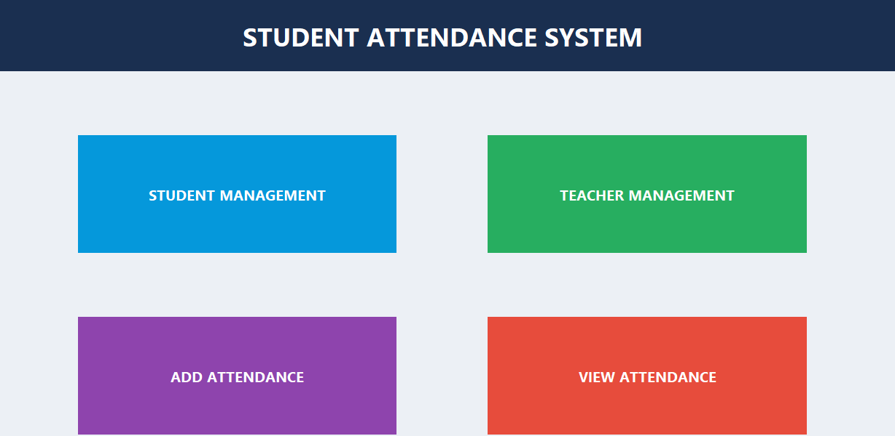
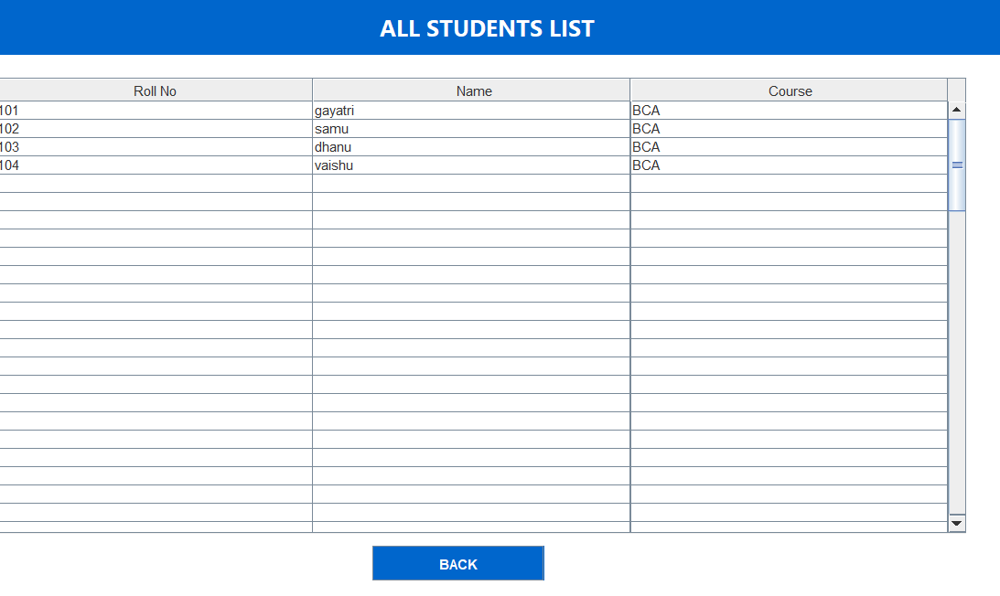
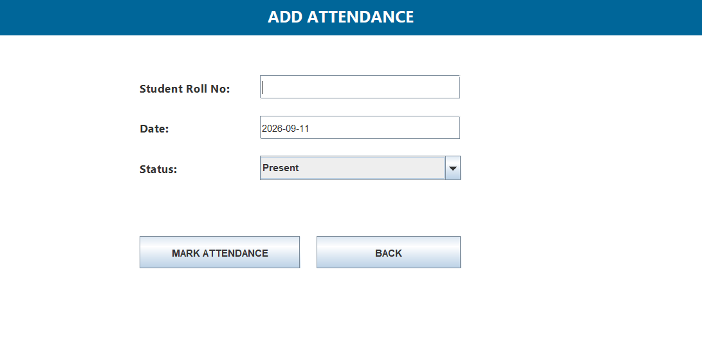
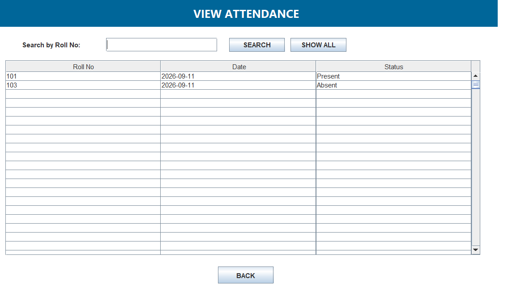

# Student Attendance Management System | Java, MySQL, Swing

A desktop application built in Java (Swing) & MySQL to manage student attendance efficiently. This system automates student records, daily attendance marking, and report generation.


### ✨ Features
- **Student Management:** Add / Update / Delete Student Records
- **Mark Attendance:** Mark daily attendance with date
- **View Reports:** View attendance report student-wise and date-wise
- **Admin Login:** Secure Login System for Admin
- **User-Friendly UI:** Simple Swing-based interface

### 📸 Screenshots

| Dashboard | Student List |
| :---: | :---: |
|  |  |
| **Mark Attendance** | **View Attendance** |
|  |  |

### 🛠️ Tech Stack
- **Frontend:** Java Swing (NetBeans)
- **Backend:** Java
- **Database:** MySQL
- **Build Tool:** Ant (build.xml)

### ⚙️ How to Run This Project

**1. Prerequisites**
- Install JDK 8 or above
- Install MySQL Server
- Install NetBeans IDE

**2. Database Setup**
- Create a database named `attendance_db` in MySQL
- Import the SQL file (if available) or create tables: `student`, `attendance`, `admin`
- Update DB credentials in `src/attendance/DBConnection.java`

```java
Connection con = DriverManager.getConnection("jdbc:mysql://localhost:3306/attendance_db", "root", "your_password");
